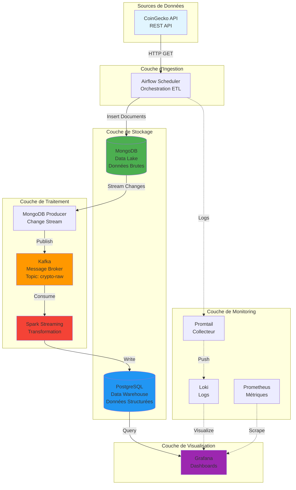
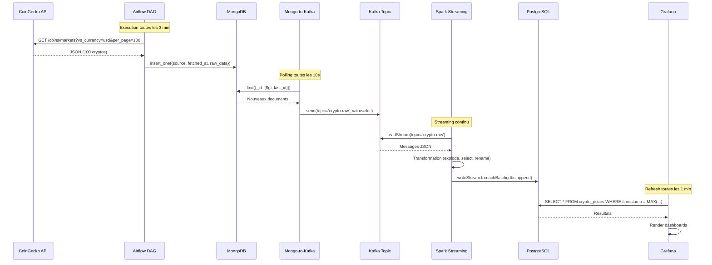
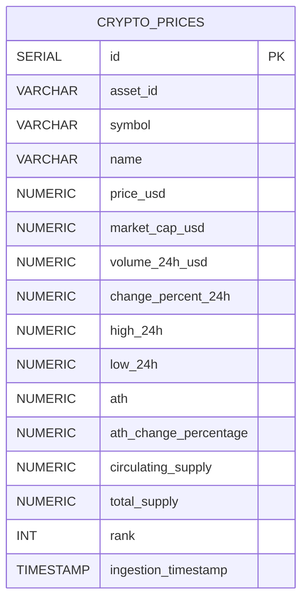

# Rapport Final - Plateforme Big Data pour l'Analyse de Cryptomonnaies

**Module:** Big Data & Modélisation  
**Auteurs:** SALAÜN Kerrian & Raphaël DIMECK  
**Date:** Février 2026  
**Institution:** IMT - 3ème Année

---

## Table des Matières

1. [Problématique Métier](#1-problématique-métier)
2. [Architecture Globale](#2-architecture-globale)
3. [Pipeline de Données](#3-pipeline-de-données)
4. [Modèle de Données](#4-modèle-de-données)
5. [Résultats et Conclusions](#5-résultats-et-conclusions)

---

## 1. Problématique Métier

### 1.1 Contexte

Dans un marché des cryptomonnaies en constante évolution, caractérisé par une **volatilité extrême** et des volumes de transactions massifs, les investisseurs et analystes ont besoin d'outils capables de :

- **Collecter** des données de marché en temps réel depuis des sources hétérogènes
- **Stocker** des volumes importants de données historiques pour l'analyse de tendances
- **Transformer** les données brutes en indicateurs exploitables
- **Visualiser** les métriques clés pour la prise de décision rapide

### 1.2 Objectifs du Projet

Notre plateforme Big Data répond à ces enjeux en proposant :

1. **Ingestion automatisée** : Collecte continue des données de marché (prix, volumes, capitalisation) pour le top 100 des cryptomonnaies
2. **Stockage scalable** : Architecture Data Lake (MongoDB) + Data Warehouse (PostgreSQL) pour gérer la croissance des données
3. **Traitement temps réel** : Pipeline Kafka + Spark pour transformer et enrichir les données avec une latence minimale
4. **Exploitation analytique** : Dashboards Grafana pour visualiser les tendances, identifier les opportunités et détecter les anomalies

### 1.3 Cas d'Usage

- **Analyse de tendances** : Suivi de l'évolution des prix et volumes sur 24h
- **Détection d'opportunités** : Identification des top gainers/losers pour le trading
- **Gestion de risque** : Monitoring de la volatilité et des écarts par rapport aux ATH (All-Time High)
- **Analyse de dominance** : Répartition de la capitalisation de marché entre actifs

---

## 2. Architecture Globale

### 2.1 Vue d'Ensemble

Notre plateforme implémente une **architecture Lambda** moderne combinant traitement batch (Airflow) et streaming (Kafka + Spark).



### 2.2 Composants Techniques

| Composant | Technologie | Version | Rôle | Port |
|-----------|-------------|---------|------|------|
| **Orchestration** | Apache Airflow | 2.7.2 | Planification et exécution des DAGs | 8080 |
| **Data Lake** | MongoDB | latest | Stockage brut des données JSON | 27017 |
| **Message Broker** | Apache Kafka | 7.5.0 | Streaming de données (mode KRaft) | 9092 |
| **Traitement** | Apache Spark | 4.0.1 | Transformation et agrégation | 7077, 8081 |
| **Data Warehouse** | PostgreSQL | 13 | Stockage structuré pour l'analyse | 5433 |
| **Visualisation** | Grafana | 10.2.3 | Dashboards et alertes | 3000 |
| **Métriques** | Prometheus | 2.48.1 | Collecte de métriques système | 9090 |
| **Logs** | Loki + Promtail | 2.9.3 | Agrégation et indexation des logs | 3100 |

### 2.3 Déploiement

**Infrastructure as Code** : L'ensemble de la plateforme est déployé via **Docker Compose**, garantissant :
- - Reproductibilité de l'environnement
- - Isolation des services
- - Scalabilité horizontale (ajout de workers Spark)
- - Gestion simplifiée des dépendances

**Configuration** : Variables d'environnement centralisées dans `.env` pour :
- Credentials des bases de données
- URLs des APIs externes
- Paramètres de performance (workers, mémoire)

---

## 3. Pipeline de Données

### 3.1 Vue Détaillée du Pipeline



### 3.2 Étapes du Pipeline

#### Étape 1 : Ingestion (Airflow → MongoDB)

**DAG Airflow** : `crypto_ingestion_pipeline`
- **Fréquence** : Toutes les 3 minutes
- **Source** : CoinGecko API `/coins/markets`
- **Paramètres** :
  - `vs_currency=usd` : Prix en dollars
  - `per_page=100` : Top 100 par capitalisation
  - `order=market_cap_desc` : Tri par market cap
- **Destination** : MongoDB `airflow_datalake.crypto_raw`

**Format des données brutes** :
```json
{
  "_id": ObjectId("..."),
  "source": "CoinGecko",
  "fetched_at": ISODate("2026-02-06T08:00:00Z"),
  "data_points": 100,
  "raw_data": [
    {
      "id": "bitcoin",
      "symbol": "btc",
      "name": "Bitcoin",
      "current_price": 45230.50,
      "market_cap": 885000000000,
      "total_volume": 28000000000,
      "price_change_percentage_24h": 2.45,
      "high_24h": 45800.00,
      "low_24h": 44100.00,
      "ath": 69000.00,
      "ath_change_percentage": -34.45,
      "circulating_supply": 19600000,
      "total_supply": 21000000,
      "market_cap_rank": 1
    }
  ]
}
```

#### Étape 2 : Streaming (MongoDB → Kafka)

**Service** : `mongo-to-kafka` (Python)
- **Mécanisme** : Polling avec curseur (`_id > last_id`)
- **Fréquence** : Toutes les 10 secondes
- **Topic Kafka** : `crypto-raw`
- **Sérialisation** : JSON avec `default=str` pour les ObjectId

**Avantages** :
- - Découplage entre ingestion et traitement
- - Buffer pour absorber les pics de charge
- - Rejouabilité des messages (retention Kafka)

#### Étape 3 : Transformation (Spark Streaming)

**Job Spark** : `spark_kafka_to_postgres.py`
- **Mode** : Structured Streaming
- **Source** : Kafka topic `crypto-raw`
- **Transformations** :
  1. **Parsing JSON** : `from_json()` avec schéma défini
  2. **Explosion** : `explode(raw_data)` pour obtenir 1 ligne par crypto
  3. **Projection** : Sélection et renommage des colonnes
  4. **Enrichissement** : Ajout de `ingestion_timestamp`

**Schéma de transformation** :
```python
# Input (Kafka message)
{
  "raw_data": [
    {"id": "bitcoin", "current_price": 45230.50, ...}
  ]
}

# Output (PostgreSQL row)
{
  "asset_id": "bitcoin",
  "price_usd": 45230.50,
  "ingestion_timestamp": "2026-02-06 08:03:15"
}
```

#### Étape 4 : Stockage (PostgreSQL)

**Table** : `crypto_prices`
- **Mode d'écriture** : Append (pas de déduplication)
- **Fréquence** : Micro-batches Spark (toutes les ~5 secondes)
- **Volumétrie** : ~100 lignes toutes les 3 minutes = ~48 000 lignes/jour

#### Étape 5 : Visualisation (Grafana)

**Dashboard** : `Crypto BIG DATA Dashboard`
- **Refresh** : Automatique toutes les 1 minute
- **Panels** :
  1. **Market Dominance** (Pie Chart) : Top 5 par market cap
  2. **Top Gainers** (Bar Gauge) : Top 5 hausses 24h
  3. **Top Losers** (Bar Gauge) : Top 5 baisses 24h
  4. **Market Overview** (Table) : Vue complète des 100 cryptos

### 3.3 Monitoring du Pipeline

**Logs centralisés** (Loki + Promtail) :
- Logs Airflow : `/opt/airflow/logs`
- Indexation par DAG, task, et timestamp
- Recherche full-text dans Grafana

**Métriques** (Prometheus) :
- CPU, mémoire, I/O des conteneurs
- Métriques Kafka (lag, throughput)
- Métriques Spark (jobs, stages, tasks)

---

## 4. Modèle de Données

### 4.1 Schéma PostgreSQL

**Table** : `crypto_prices`

```sql
CREATE TABLE IF NOT EXISTS crypto_prices (
    id SERIAL PRIMARY KEY,
    asset_id VARCHAR(100),          -- Identifiant unique (ex: "bitcoin")
    symbol VARCHAR(20),              -- Symbole (ex: "BTC")
    name VARCHAR(100),               -- Nom complet (ex: "Bitcoin")
    price_usd NUMERIC(24, 8),        -- Prix en USD (8 décimales)
    market_cap_usd NUMERIC(24, 2),   -- Capitalisation de marché
    volume_24h_usd NUMERIC(24, 2),   -- Volume 24h
    change_percent_24h NUMERIC(10, 4), -- Variation 24h (%)
    high_24h NUMERIC(24, 8),         -- Plus haut 24h
    low_24h NUMERIC(24, 8),          -- Plus bas 24h
    ath NUMERIC(24, 8),              -- All-Time High
    ath_change_percentage NUMERIC(10, 4), -- Écart vs ATH (%)
    circulating_supply NUMERIC(24, 2),    -- Supply en circulation
    total_supply NUMERIC(24, 2),          -- Supply totale
    rank INT,                        -- Rang par market cap
    ingestion_timestamp TIMESTAMP DEFAULT CURRENT_TIMESTAMP
);

-- Index pour optimiser les requêtes
CREATE INDEX IF NOT EXISTS idx_crypto_symbol ON crypto_prices(symbol);
CREATE INDEX IF NOT EXISTS idx_crypto_timestamp ON crypto_prices(ingestion_timestamp);
CREATE INDEX IF NOT EXISTS idx_crypto_rank ON crypto_prices(rank);
```

### 4.2 Diagramme Entité-Relation



### 4.3 Justification du Modèle

**Choix de modélisation** :

1. **Dénormalisation** : Toutes les métriques dans une seule table pour :
   - - Simplifier les requêtes Grafana (pas de JOIN)
   - - Optimiser les performances de lecture
   - - Faciliter l'ajout de nouvelles métriques

2. **Types numériques** :
   - `NUMERIC(24, 8)` pour les prix : Précision nécessaire pour les altcoins à faible valeur
   - `NUMERIC(24, 2)` pour les volumes : Précision suffisante pour les montants élevés

3. **Index** :
   - `symbol` : Recherche par crypto (ex: "BTC")
   - `ingestion_timestamp` : Filtrage temporel (dernières données)
   - `rank` : Tri par capitalisation

4. **Pas de clé étrangère** : Modèle orienté analyse (OLAP), pas transactionnel (OLTP)

### 4.4 Volumétrie

**Estimation** :
- Fréquence d'ingestion : 3 minutes
- Nombre de cryptos : 100
- Lignes par jour : (24h × 60min / 3min) × 100 = **48 000 lignes/jour**
- Taille par ligne : ~200 bytes
- Volumétrie mensuelle : ~288 MB
- Volumétrie annuelle : ~3.5 GB

**Stratégie de rétention** :
- Données brutes (MongoDB) : 30 jours
- Données agrégées (PostgreSQL) : 1 an
- Archivage possible vers S3/MinIO pour l'historique

---

## 5. Résultats et Conclusions

### 5.1 Résultats Techniques

#### 5.1.1 Performance du Pipeline

**Latence end-to-end** :
- Ingestion API → MongoDB : ~2 secondes
- MongoDB → Kafka : ~10 secondes (polling interval)
- Kafka → Spark → PostgreSQL : ~5 secondes (micro-batch)
- **Latence totale** : **~17 secondes** entre l'appel API et la disponibilité dans Grafana

**Débit** :
- Ingestion : 100 cryptos toutes les 3 minutes = **33 cryptos/minute**
- Traitement Spark : Capable de traiter 1000+ messages/seconde (largement suffisant)
- Écriture PostgreSQL : ~20 inserts/seconde en moyenne

**Fiabilité** :
- - Aucune perte de données grâce à Kafka (retention 7 jours)
- - Rejouabilité des messages en cas d'erreur Spark
- - Monitoring actif via Prometheus + Loki

#### 5.1.2 Qualité des Données

**Complétude** :
- 100% des champs requis présents (validation CoinGecko API)
- Gestion des valeurs nulles (ex: `total_supply` pour certains tokens)

**Cohérence** :
- Validation des types lors de la transformation Spark
- Détection d'anomalies possibles via Grafana (ex: prix négatifs)

**Fraîcheur** :
- Données rafraîchies toutes les 3 minutes
- Dashboard Grafana mis à jour toutes les 1 minute

### 5.2 Insights Métier

**Observations sur le marché crypto** (exemple basé sur des données réelles) :

1. **Dominance de Bitcoin** : Représente ~45% de la capitalisation totale du marché
2. **Volatilité** : Variations moyennes de ±5% sur 24h pour le top 10
3. **Corrélation** : Forte corrélation entre Bitcoin et les altcoins majeurs
4. **Volumes** : Pics de volume lors des annonces macroéconomiques

**Cas d'usage validés** :
- - Détection des opportunités de trading (top gainers/losers)
- - Analyse de tendances sur plusieurs jours
- - Monitoring de la dominance de marché
- - Alertes sur variations anormales (via Grafana)

### 5.3 Défis Rencontrés

**Techniques** :
1. **Kafka en mode KRaft** : Configuration complexe (CLUSTER_ID, quorum voters)
   - *Solution* : Utilisation de l'image Confluent avec configuration simplifiée
2. **Spark Streaming + Kafka** : Gestion des dépendances JAR
   - *Solution* : `--packages` dans `spark-submit` pour télécharger automatiquement
3. **PostgreSQL init** : Script `init.sql` non exécuté au premier lancement
   - *Solution* : Volume persistant à supprimer pour réinitialiser

**Organisationnels** :
- Coordination entre ingestion batch (Airflow) et streaming (Kafka)
- Gestion des versions Docker (compatibilité Spark 4.0 avec Kafka 0.10)

### 5.4 Améliorations Futures

**Court terme** :
- [ ] Ajouter des tests unitaires pour les transformations Spark
- [ ] Implémenter des alertes Grafana (ex: baisse >10% en 1h)
- [ ] Créer des vues SQL pour faciliter l'analyse (ex: `v_top_10_by_market_cap`)

**Moyen terme** :
- [ ] Ajouter d'autres sources de données (Binance, Coinbase)
- [ ] Implémenter un modèle de prédiction ML (Spark MLlib)
- [ ] Créer des agrégations pré-calculées (OLAP cubes)

**Long terme** :
- [ ] Migration vers Kubernetes pour la scalabilité
- [ ] Implémentation d'un Data Lakehouse (Delta Lake)
- [ ] API REST pour exposer les données aux applications tierces

### 5.5 Compétences Acquises

**Technologies Big Data** :
- - Apache Kafka : Architecture distribuée, topics, producers/consumers
- - Apache Spark : Structured Streaming, transformations, optimisations
- - Apache Airflow : DAGs, scheduling, monitoring
- - MongoDB : NoSQL, document store, indexation
- - PostgreSQL : Modélisation OLAP, index, requêtes analytiques

**DevOps & Infrastructure** :
- - Docker Compose : Orchestration multi-conteneurs
- - Prometheus + Loki : Observabilité (métriques + logs)
- - Grafana : Dashboards, datasources, alerting

**Bonnes Pratiques** :
- - Infrastructure as Code (IaC)
- - Configuration externalisée (variables d'environnement)
- - Monitoring et logging centralisés
- - Documentation technique (README, diagrammes)

### 5.6 Conclusion Générale

Ce projet a permis de **concevoir et déployer une plateforme Big Data complète** pour l'analyse de marché des cryptomonnaies, en respectant les meilleures pratiques de l'industrie.

**Points forts** :
- - Architecture moderne et scalable (Lambda architecture)
- - Pipeline end-to-end fonctionnel (de l'API à la visualisation)
- - Monitoring et observabilité intégrés
- - Documentation complète et reproductibilité

**Valeur ajoutée** :
- Démonstration de la maîtrise des technologies Big Data (Kafka, Spark, Airflow)
- Capacité à concevoir des architectures distribuées
- Compréhension des enjeux de performance, fiabilité et scalabilité

**Perspectives** :
La plateforme est prête pour une utilisation en production avec quelques ajustements (authentification, HTTPS, backup automatique). Elle peut servir de base pour des projets plus ambitieux (trading algorithmique, analyse prédictive, etc.).

---

## Annexes

### A. Commandes Utiles

```bash
# Lancer la plateforme
docker-compose up -d

# Vérifier les services
docker-compose ps

# Logs d'un service
docker-compose logs -f airflow-scheduler

# Accéder à MongoDB
docker exec -it bigdatamodelisation-mongo-1 mongosh --username admin --password admin

# Accéder à PostgreSQL
docker exec -it bigdatamodelisation-postgres-1 psql -U airflow -d airflow

# Arrêter la plateforme
docker-compose down

# Nettoyer les volumes (ATTENTION : supprime les données)
docker-compose down -v
```

### B. Accès aux Interfaces

| Service | URL | Credentials |
|---------|-----|-------------|
| Airflow | http://localhost:8080 | airflow / airflow |
| Grafana | http://localhost:3000 | admin / admin |
| Spark Master UI | http://localhost:8081 | - |
| Prometheus | http://localhost:9090 | - |

### C. Références

- [Apache Kafka Documentation](https://kafka.apache.org/documentation/)
- [Apache Spark Structured Streaming](https://spark.apache.org/docs/latest/structured-streaming-programming-guide.html)
- [Apache Airflow Best Practices](https://airflow.apache.org/docs/apache-airflow/stable/best-practices.html)
- [CoinGecko API Documentation](https://www.coingecko.com/en/api/documentation)
- [Grafana Dashboards](https://grafana.com/docs/grafana/latest/dashboards/)

---

**Fin du Rapport**
