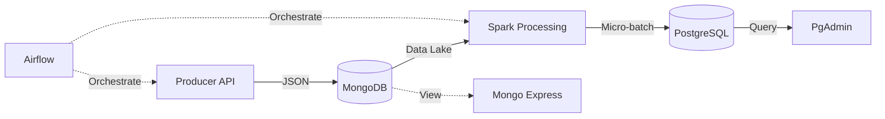

# Big Data Processing Platform

Ce module vise à fournir une vision complète et opérationnelle d’une chaîne de traitement de données moderne, allant de la génération de données brutes jusqu’à leur exploitation analytique.

## Architecture

L'architecture repose entièrement sur une stack technique Dockerisée :



*   **Ingestion (API -> Mongo)** : Le script `producer` récupère les données CoinCap et les stocke brutes dans **MongoDB** (Data Lake).
*   **Traitement (Spark)** : Un job Spark lit depuis MongoDB, nettoie les données et les écrit dans **PostgreSQL**.
*   **Stockage Structuré (PostgreSQL)** : Base de données pour l'analytique.
*   **Visualisation** : PgAdmin (SQL) et Mongo Express (NoSQL).
*   **Orchestration (Airflow)** : Supervise le pipeline.

## Prérequis

*   Docker
*   Docker Compose

## Installation et Lancement

1.  Cloner ce dépôt.
2.  Revoir le fichier `.env` si nécessaire (les configurations par défaut devraient fonctionner).
3.  Lancer la stack complète :

```bash
docker-compose up -d --build
```

## Structure du Projet

*   `api/` / `producer/` : Scripts de génération de données (Source).
*   `spark/` : Scripts de traitement PySpark (Processeur).
*   `postgres/` : Scripts d'initialisation de la base de données.
*   `airflow/` : DAGs et configuration Airflow.
*   `docker-compose.yml` : Définition de l'infrastructure.

## Vérification

*   **Airflow UI** : http://localhost:8081 (admin/admin)
*   **Mongo Express** : http://localhost:8082 (admin/admin) - *Pour explorer le Data Lake*
*   **PgAdmin** : http://localhost:5050 (`admin@admin.com` / `admin`)
    *   *Ajouter le serveur* : Hostname: `postgres`, Username: `admin`, Password: `admin`.
*   **Spark Master UI** : http://localhost:8080
*   **Base de données** : Connectez-vous à PostgreSQL sur le port 5432 (user: `admin`, password: `admin`, db: `bigdata_db`).

## Développement

Pour modifier le traitement Spark, éditez `spark/processor.py` et reconstruisez le conteneur :
```bash
docker-compose build spark-consumer
docker-compose up -d spark-consumer
```
