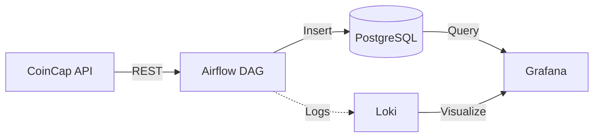

# Big Data Processing Platform - Crypto Analytics

Plateforme simplifiée d'ingestion et d'analyse de données crypto-monnaies avec Airflow, PostgreSQL et Grafana.

## Architecture



*   **Ingestion (Airflow)** : DAG Python qui interroge l'API CoinCap toutes les 10 minutes et stocke les données dans PostgreSQL.
*   **Stockage (PostgreSQL)** : Base de données relationnelle pour les prix crypto.
*   **Monitoring (Grafana + Loki)** : Visualisation des logs Airflow et métriques.

## Prérequis

*   Docker
*   Docker Compose

## Installation et Lancement

1.  Cloner ce dépôt.
2.  Vérifier le fichier `.env` (configurations par défaut fonctionnelles).
3.  Lancer la stack :

```bash
docker-compose up -d
```

## Structure du Projet

*   `airflow/dags/` : DAGs Airflow (pipeline d'ingestion).
*   `airflow/logs/` : Logs Airflow.
*   `postgres/` : Scripts d'initialisation de la base de données.
*   `monitoring/` : Configuration Promtail et Grafana.
*   `src/` : Scripts Python personnalisés (si nécessaire).

## Accès aux Services

*   **Airflow UI** : http://localhost:8080 (airflow/airflow)
*   **Grafana** : http://localhost:3000 (admin/admin)
*   **PostgreSQL** : localhost:5433 (airflow/airflow)

## Variables d'Environnement

Toutes les variables sont définies dans `.env` :

*   `POSTGRES_USER`, `POSTGRES_PASSWORD`, `POSTGRES_DB` : Credentials PostgreSQL
*   `AIRFLOW_IMAGE_NAME` : Image Docker Airflow
*   `COINCAP_API_URL` : URL de l'API CoinCap
*   `CRYPTO_ASSETS` : Liste des cryptos à suivre (séparées par des virgules)

## Développement

Pour modifier le DAG, éditez `airflow/dags/pipeline_dag.py` et redémarrez le scheduler :
```bash
docker-compose restart airflow-scheduler
```

## Visualisation dans Grafana

1.  Accédez à http://localhost:3000
2.  Ajoutez PostgreSQL comme source de données :
    *   Host: `postgres:5432`
    *   Database: `airflow`
    *   User: `airflow`
    *   Password: `airflow`
3.  Créez un dashboard pour visualiser les prix crypto en temps réel.
