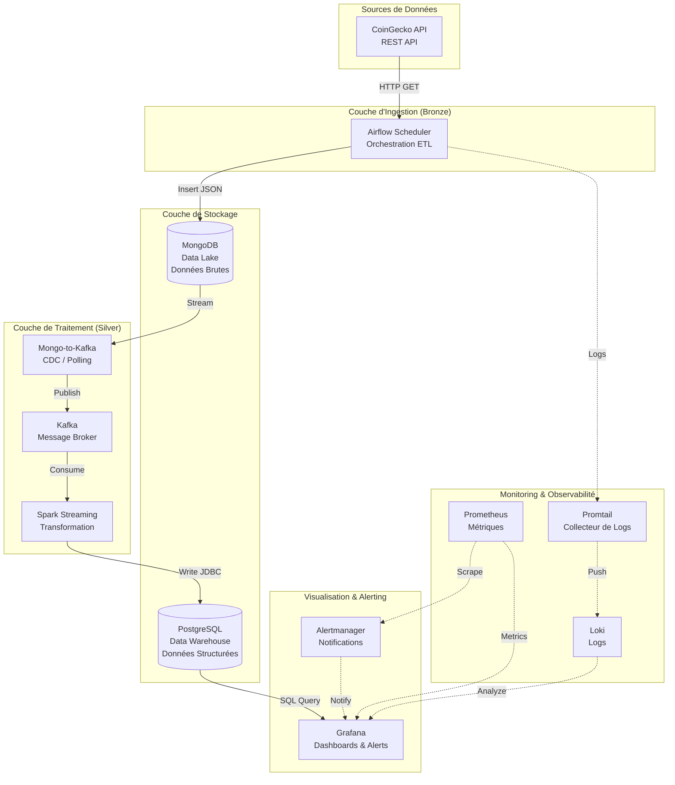

# 🚀 Plateforme Big Data : Pipeline ETL pour Cryptomonnaies

[](https://github.com/KerrianS/BigDataModelisation/actions/workflows/ci.yml)

## ✍️ Auteurs
**SALÄUN Kerrian** & **Raphaël DIMECK** (IMT Nord Europe - Février 2026)

---

## 📖 Présentation du Projet
Ce projet implémente une plateforme **Big Data** de bout en bout pour l'ingestion, le traitement et la visualisation de données de marché en temps réel pour le **top 100 des cryptomonnaies**. 
> **Security**: This project uses GitHub Secrets for CI/CD credentials. See [docs/GITHUB_SECRETS.md](docs/GITHUB_SECRETS.md) for configuration instructions.

## Prerequisites

L'architecture repose sur un modèle **Lambda/Lakehouse** moderne garantissant :
- **Persistance** des données brutes (Data Lake - MongoDB).
- **Vitesse** du traitement en streaming (Kafka + Spark).
- **Puissance** des requêtes analytiques (Data Warehouse - PostgreSQL).
- **Observabilité** totale (Grafana + Prometheus + Loki + Alerting).

---

## 🏗️ Architecture Globale



---

## 🛠️ Stack Technique & Rôles

| Composant | Technologie | Rôle Technique |
| :--- | :--- | :--- |
| **Orchestrateur** | **Airflow** | Planification des tâches (DAGs) et appels API CoinGecko toutes les 3 min. |
| **Data Lake** | **MongoDB** | Stockage immuable des documents JSON bruts originaux. |
| **Bus d'Événements** | **Kafka** | Découplage des services et buffer de streaming haute performance. |
| **Moteur SQL** | **Spark** | Transformation complexe, nettoyage et typage des données en micro-batches. |
| **Warehouse** | **PostgreSQL** | Stockage structuré et indexé pour la visualisation rapide. |
| **Observabilité** | **Prometheus** | Collecte des métriques système (CPU, RAM, Uptime). |
| **Gestion Logs** | **Loki + Promtail** | Centralisation et indexation de tous les logs containers. |
| **Visualisation** | **Grafana** | Dashboards temps réel et gestionnaire centralisé d'alertes. |
| **Alerting** | **Alertmanager** | Groupement et routage des alertes vers les terminaux finaux. |

---

## 🚨 Système d'Alerting (Nouveau)

La plateforme intègre désormais un système d'alertes à deux niveaux :

### 1. Alertes d'Infrastructure (via Prometheus & Alertmanager)
- **ServiceDown** : Déclenché si un container (Airflow, Spark, Kafka) ne répond plus pendant plus d'une minute.
- **IngestionLagging** : Détecte si le job Airflow n'est plus visible par le système de monitoring.

### 2. Alertes Métier & Pipeline (via Grafana Unified Alerting)
- **Bitcoin Price Crash** : Alerte critique déclenchée si le cours du Bitcoin varie de plus de **-10%** sur 24h.
- **Ingestion Pipeline Stalled** : Alerte de sécurité activée si aucune nouvelle donnée n'est insérée dans PostgreSQL pendant plus de **10 minutes** (signe d'un blocage Spark ou Kafka).

---

## 📋 Prérequis & Installation

### Prérequis
- **Docker** & **Docker Compose** installés.
- Au moins **8 Go de RAM** alloués à Docker pour supporter Spark et Kafka simultanément.

### Lancement Rapide
1. **Configurer l'environnement** :
   ```bash
   cp .env.example .env
   # Modifier les credentials si nécessaire
   ```
2. **Démarrer la stack** :
   ```bash
   docker-compose up -d
   ```
3. **Vérifier l'état** :
   ```bash
   docker-compose ps
   ```

---

## 🔗 Accès aux Services

| Service | URL | Identifiants |
| :--- | :--- | :--- |
| **Airflow UI** | [http://localhost:8080](http://localhost:8080) | `airflow` / `airflow` |
| **Grafana** | [http://localhost:3000](http://localhost:3000) | `admin` / `admin` |
| **Prometheus** | [http://localhost:9090](http://localhost:9090) | - |
| **Alertmanager** | [http://localhost:9093](http://localhost:9093) | - |
| **Spark Master** | [http://localhost:8081](http://localhost:8081) | - |

---

## 🧪 Maintenance & Tests

### Scripts Utilitaires (`/src`)
- `check_datalake.py` : Compare les données dans MongoDB et Postgres.
- `manual_ingestion.py` : Force un appel API immédiat sans attendre le scheduler Airflow.
- `test_mongo.py` : Vérifie la connectivité au Data Lake.

### Commandes Utiles
```bash
# Redémarrer uniquement le pipeline de traitement
docker-compose restart spark-streaming

# Consulter les logs d'ingestion
docker-compose logs -f airflow-scheduler

# Simuler un crash pour tester les alertes
docker-compose stop spark-worker
```

### Accès direct aux bases de données
- **Postgres** : `docker exec -it bigdatamodelisation-postgres-1 psql -U airflow -d airflow`
- **MongoDB** : `docker exec -it bigdatamodelisation-mongo-1 mongosh --username admin --password admin`

---

## 🔮 Roadmap & Améliorations Futures
- [ ] **Data Quality** : Ajout de Great Expectations pour valider les données en sortie de Spark.
- [ ] **Diversification** : Intégration de l'API Binance et Coinbase pour comparer les prix.
- [ ] **IA** : Implémentation d'un modèle de prédiction via Spark MLlib.
- [ ] **Déploiement** : Migration de l'architecture vers Kubernetes (K8s) avec Helm Charts.

---
**Note sur la sécurité** : Toutes les communications entre composants se font via le réseau Docker sécurisé interne. Pour une exposition publique, l'utilisation d'un Reverse Proxy (Nginx/Traefik) avec HTTPS est impérative.