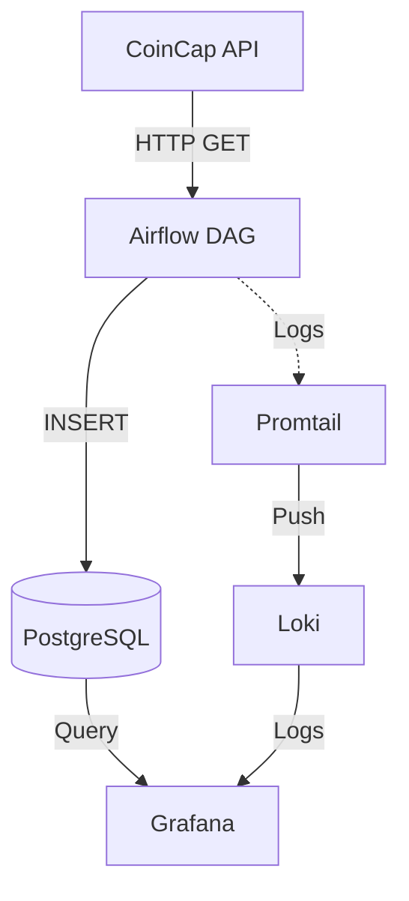

# Rapport de Projet Big Data - Crypto Analytics

## 1. Problématique Métier

Dans un contexte de volatilité extrême des marchés crypto-monnaies, les traders et analystes ont besoin d'outils fiables pour :
*   **Collecter** des données de prix en temps réel
*   **Historiser** les données pour analyse de tendances
*   **Monitorer** la santé du pipeline d'ingestion

Ce projet propose une **plateforme d'ingestion et d'analyse de données crypto** basée sur des technologies Big Data modernes.

## 2. Architecture Globale

L'architecture repose sur une stack simplifiée et moderne :

*   **Orchestration** : Apache Airflow
*   **Stockage** : PostgreSQL
*   **Monitoring** : Grafana + Loki + Promtail
*   **Infrastructure** : Docker & Docker Compose



## 3. Pipeline de Données

Le flux de données est orchestré par Airflow :

1.  **Déclenchement** : Le DAG `crypto_ingestion_pipeline` s'exécute toutes les 10 minutes.
2.  **Extraction** : Requête HTTP vers l'API CoinCap pour récupérer les prix de Bitcoin, Ethereum, Solana, etc.
3.  **Transformation** : Parsing du JSON et extraction des champs pertinents (prix, market cap, volume).
4.  **Chargement** : Insertion dans PostgreSQL (table `crypto_prices`).
5.  **Monitoring** : Les logs Airflow sont collectés par Promtail et envoyés à Loki pour visualisation dans Grafana.

## 4. Modèle de Données

Les données brutes JSON de l'API CoinCap :
```json
{
    "id": "bitcoin",
    "symbol": "BTC",
    "name": "Bitcoin",
    "priceUsd": "43256.78",
    "marketCapUsd": "847123456789.12",
    "volumeUsd24Hr": "12345678901.23",
    "changePercent24Hr": "2.45"
}
```

Sont transformées en table PostgreSQL `crypto_prices` :

| Colonne              | Type           | Description                    |
|----------------------|----------------|--------------------------------|
| id                   | SERIAL (PK)    | Identifiant technique          |
| asset_id             | VARCHAR(50)    | ID de l'asset (bitcoin, etc.)  |
| symbol               | VARCHAR(20)    | Symbole (BTC, ETH...)          |
| name                 | VARCHAR(50)    | Nom complet                    |
| price_usd            | NUMERIC(20,8)  | Prix en USD                    |
| market_cap_usd       | NUMERIC(20,2)  | Capitalisation boursière       |
| volume_24h_usd       | NUMERIC(20,2)  | Volume 24h                     |
| change_percent_24h   | NUMERIC(10,4)  | Variation 24h (%)              |
| ingestion_timestamp  | TIMESTAMP      | Date d'ingestion               |

## 5. Résultats et Conclusions

Ce projet démontre la faisabilité d'une **architecture Big Data simplifiée** pour l'ingestion de données financières :

✅ **Avantages** :
*   Stack légère (pas de Kafka/Spark pour ce cas d'usage)
*   Orchestration robuste avec Airflow
*   Monitoring intégré avec Grafana
*   Facilité de déploiement (Docker Compose)

🔧 **Évolutions possibles** :
*   Ajout de Spark pour traitement batch complexe
*   Intégration d'un Data Lake (MongoDB) pour stockage brut
*   Alerting automatique sur variations de prix
*   Dashboard Grafana temps réel

L'approche "Infrastructure as Code" avec Docker permet un déploiement rapide et reproductible en environnement de production.
