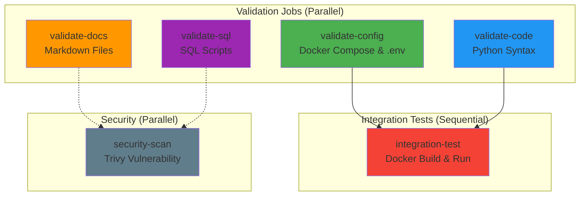

# Documentation CI/CD - Pipeline Big Data

## Vue d'Ensemble

Le workflow CI/CD GitHub Actions valide automatiquement la qualité du code, la configuration et la documentation à chaque push ou pull request.

## Architecture du Workflow



## Jobs Détaillés

### 1. **validate-config** -
Valide la configuration Docker et les variables d'environnement.

**Étapes :**
- Vérification de l'existence de `.env.example`
- Validation de la syntaxe `docker-compose.yml` avec `docker compose config`

**Commande locale :**
```bash
docker compose config
```

### 2. **validate-code** 🐍
Valide la syntaxe Python de tous les scripts.

**Étapes :**
- Installation de Python 3.11
- Installation des dépendances (Airflow, PySpark, pymongo, kafka-python)
- Compilation de tous les fichiers `.py` :
  - Airflow DAGs (`airflow/dags/*.py`)
  - Scripts Spark (`spark/*.py`)
  - Scripts utilitaires (`src/*.py`)
  - Scripts producteurs (`producer/*.py`)

**Commande locale :**
```bash
pip install apache-airflow==2.7.2 pyspark==3.5.0 pymongo kafka-python
python -m py_compile airflow/dags/*.py src/*.py
```

### 3. **validate-docs** 📝
Valide l'existence et la syntaxe de la documentation.

**Étapes :**
- Vérification de `README.md` (obligatoire)
- Vérification de `RAPPORT.md` (recommandé)
- Linting Markdown avec `markdownlint`

**Commande locale :**
```bash
# Installer markdownlint-cli
npm install -g markdownlint-cli

# Valider les fichiers Markdown
markdownlint *.md
```

### 4. **validate-sql** 
Vérifie l'existence des scripts SQL.

**Étapes :**
- Liste les fichiers `.sql` dans `postgres/`

### 5. **integration-test** 
Test d'intégration complet du pipeline Docker.

**Étapes :**
1. Création du fichier `.env` depuis `.env.example`
2. Build des images Docker (`docker compose build`)
3. Démarrage des services core (postgres, mongo, kafka)
4. Attente de 30 secondes pour le démarrage
5. Vérification que les services sont en cours d'exécution
6. Cleanup (arrêt et suppression des volumes)

**Commande locale :**
```bash
docker compose build
docker compose up -d postgres mongo kafka
docker compose ps
docker compose down -v
```

### 6. **security-scan** 
Scan de sécurité avec Trivy.

**Étapes :**
- Scan des fichiers de configuration pour détecter les vulnérabilités critiques et élevées

**Commande locale :**
```bash
# Installer Trivy
# https://aquasecurity.github.io/trivy/latest/getting-started/installation/

trivy config .
```

## Améliorations par Rapport à l'Ancien Workflow

| Aspect | Ancien | Nouveau |
|--------|--------|---------|
| **Docker Compose** | `docker-compose` (v1) - | `docker compose` (v2) - |
| **Validation Python** | DAGs uniquement | DAGs + Spark + src + producer - |
| **Tests d'intégration** | Aucun | Build + Run + Health check - |
| **Sécurité** | Aucun | Trivy vulnerability scan - |
| **Documentation** | Aucun | Validation README + RAPPORT - |
| **Jobs parallèles** | Non | Oui (4 jobs en parallèle) - |
| **Badge CI** | Non | Oui (dans README) - |

## Résolution du Problème Initial

**Erreur originale :**
```
docker-compose: command not found
Error: Process completed with exit code 127.
```

**Cause :** GitHub Actions runners (Ubuntu latest) n'ont plus `docker-compose` v1 installé par défaut depuis 2023.

**Solution :** Utilisation de `docker compose` (v2) qui est intégré nativement à Docker Engine.

## Utilisation

### Déclenchement Automatique

Le workflow se déclenche automatiquement sur :
- Push vers `main` ou `master`
- Pull request vers `main` ou `master`

### Déclenchement Manuel

Depuis l'interface GitHub :
1. Aller dans l'onglet **Actions**
2. Sélectionner **Big Data Platform CI/CD**
3. Cliquer sur **Run workflow**

### Visualisation des Résultats

**Badge CI dans README :**
```markdown
[](https://github.com/KerrianS/BigDataModelisation/actions/workflows/ci.yml)
```

**Statuts possibles :**
- **Passing** : Tous les jobs ont réussi
- **Failing** : Au moins un job a échoué
- **Running** : Workflow en cours d'exécution

## Debugging

### Voir les Logs d'un Job

1. Aller dans **Actions** > Sélectionner le workflow
2. Cliquer sur le job qui a échoué
3. Développer les étapes pour voir les logs détaillés

### Reproduire Localement

```bash
# Valider la config Docker
docker compose config

# Valider le code Python
pip install apache-airflow==2.7.2 pyspark==3.5.0
python -m py_compile airflow/dags/*.py

# Tester l'intégration
docker compose up -d postgres mongo kafka
docker compose ps
docker compose down -v
```

## Prochaines Étapes

**Améliorations futures :**
- [ ] Ajouter des tests unitaires Python (pytest)
- [ ] Implémenter des tests de performance (load testing)
- [ ] Ajouter un job de déploiement automatique (CD)
- [ ] Configurer des notifications Slack/Discord en cas d'échec
- [ ] Ajouter un cache pour les dépendances Python (accélérer le build)

## Références

- [GitHub Actions Documentation](https://docs.github.com/en/actions)
- [Docker Compose v2 Migration](https://docs.docker.com/compose/migrate/)
- [Trivy Security Scanner](https://aquasecurity.github.io/trivy/)
